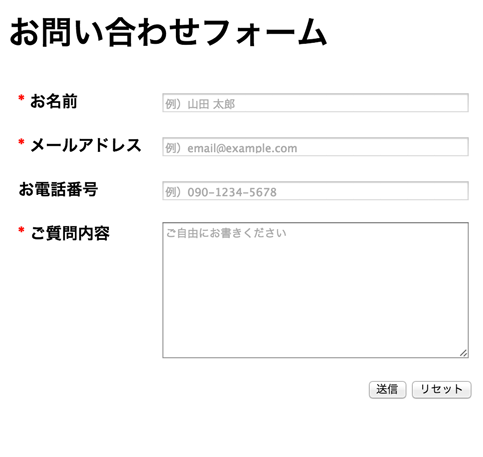
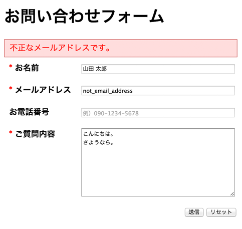
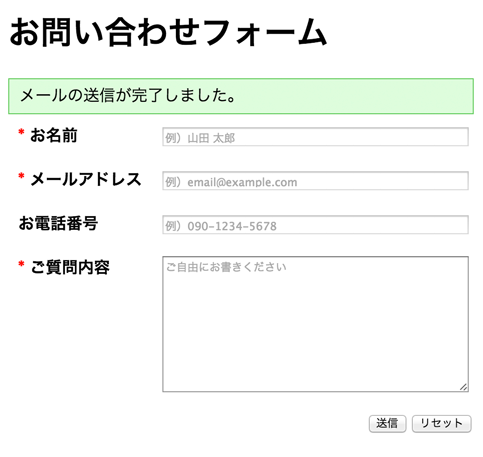

# 問い合わせフォームを作ってみる

この章では、フォームと連携した PHP のプログラム方法と、基礎的なセキュリティ対策について学んできました。
ここで学んだ内容を使って、実用的な Web アプリケーションの第一歩、「問い合わせフォーム」を作ってみましょう！

```
~/workspace/php-abc-quests/practices/03/contact-form/index.php
```

## 仕様

### 入力項目

* お名前（必須）
* メールアドレス（必須）
* お電話番号
* ご質問内容（必須）

という 4 項目のみのシンプルな問い合わせフォームです。



上図は実装例の画面イメージです。

### セキュリティ対策

XSS および CSRF の対策を適切に行ってください。

### 入力内容のチェック

* 必須項目がすべて入力されているかをチェック
* メールアドレスが、メールアドレスとして正しい文字列になっているかを [正規表現](http://ja.wikipedia.org/wiki/%E6%AD%A3%E8%A6%8F%E8%A1%A8%E7%8F%BE) を使ってチェック

という 2 点をチェックしてください。

エラーがあった場合は下図のようにエラーを出力してください。



エラーがなければ、メールを送信して下図のように成功メッセージを出力してください。



### メール送信処理

メールは 2 通送信してください。

* Web サイトの管理者宛てに送信する**通知メール**
* フォームを入力したユーザ宛てに送信する**自動返信メール**

それぞれ、以下のような内容としてください。

**Web サイト管理者宛て**
```
To: hogehoge@gmail.com
Subject: お問い合わせがありました
```
```
以下のお客様からお問い合わせがありました。

------------------------------------------------------------
お名前：山田 太郎
------------------------------------------------------------
メールアドレス：user-inputted@example.com
------------------------------------------------------------
お電話番号：090-1234-5678
------------------------------------------------------------
ご質問内容：
こんにちは。
さようなら。
------------------------------------------------------------
```

**ユーザ宛て（自動返信メール）**
```
To: user-inputted@example.com
Subject: お問い合わせがありがとうございました
```
```
以下の内容でお問い合わせを受け付けました。
担当者より折り返しご連絡を差し上げますので、今しばらくお待ちください。

------------------------------------------------------------
お名前：山田 太郎
------------------------------------------------------------
メールアドレス：user-inputted@example.com
------------------------------------------------------------
お電話番号：090-1234-5678
------------------------------------------------------------
ご質問内容：
こんにちは。
さようなら。
------------------------------------------------------------
```

## ヒント

* 複数行のテキストを入力するフォーム項目には [`<textarea>`](http://www.htmq.com/html5/textarea.shtml) タグを使います
* `<input type="">` には `"text"` 以外にも [様々なものが使えます](http://www.htmq.com/html5/input.shtml)
* `<input placeholder="">` を使うとフォーム項目に [プレースホルダを設定できます](http://www.htmq.com/html5/input_placeholder.shtml)
* PHP ではの正規表現によるパターンマッチには [preg_match()](http://php.net/manual/ja/function.preg-match.php) 関数を使います
* `<input type="email">` を使えば、メールアドレスらしからぬ文字列を送信しようとしてもブラウザが送信をブロックしてくれます。ですが、HTML5 に対応していないブラウザ（IE9 以前など）ではこの機能は使えず、そのままサーバに送信されてしまいます。なので、入力値のチェックは PHP 側でもしっかりと実施する必要があります
* `<input required>` を使えば必須扱いになるのも同様に、HTML5 非対応のブラウザでは動作しませんので、PHP 側でしっかりチェックしてください
* 適宜 [CSS](http://www.htmq.com/csskihon/index.shtml) を使って見た目を調整して、できるだけ見栄えのよいフォームを目指してください

## 解答例

解答例は [こちら](contact-form-impl.md) です。ぜひ、自力でチャレンジしてから見てください。

## 作成完了した人へ

お疲れさまでした！これであなたも立派な PHP プログラマです！

この章では PHP でサーバ側の動的な振る舞いを実装してきましたが、次の章では、JavaScript（jQuery）を使ってクライアント側でページを動的に変化させる方法を学びます。お楽しみに！
